# Project Standardization Mindmap

Tài liệu này là bản đồ chuẩn hóa của `sinhvien-app`, được dựng từ bộ tài liệu
gốc đã được xác nhận là đúng và được đối chiếu với source tree hiện tại.

Mindmap bên dưới phản ánh 2 lớp thông tin:

- hiện trạng thật của repo theo source tree;
- đích chuẩn hóa theo skill `dev`: `architecture-feature-first` -> `riverpod`
  -> `dart-3-updates` -> `effective-dart`.

```mermaid
mindmap
  root((sinhvien-app))
    Hiện trạng repo
      Flutter app ở repo root
      Pattern hiện tại
        controllers + ChangeNotifier
        services tích hợp ngoại vi
        models dữ liệu dùng chung
        utils tính toán và presenter
      Home đã split sang feature-first
        lib/features/home/ui/home_controller.dart
        lib/features/home/ui/home_shell.dart
        lib/features/home/ui/pages/*
        lib/features/home/ui/widgets/*
        lib/features/home/domain/home_flow_models.dart
        lib/features/home/domain/home_calendar_utils.dart
        lib/features/home/domain/home_calendar_types.dart
        lib/features/home/data/event_mutation_service.dart
      Grades đã split sang feature-first
        lib/features/grades/ui/grades_controller.dart
        lib/features/grades/ui/grades_page.dart
        lib/features/grades/ui/widgets/*
        lib/features/grades/domain/curriculum_presenter.dart
        lib/features/grades/domain/grade_metrics.dart

      Sync da split sang feature-first
        lib/features/sync/data/cloud_sync_service.dart
        lib/features/sync/data/dashboard_persistence_service.dart
        lib/features/sync/data/local_cache_service.dart
        lib/features/sync/data/school_api_service.dart
        lib/features/sync/data/student_sync_credentials_service.dart
        lib/features/sync/domain/school_sync_coordinator.dart
      Điều phối trung tâm
        lib/features/home/ui/home_controller.dart
        lib/features/grades/ui/grades_controller.dart
        lib/controllers/account_auth_controller.dart
      Entry points
        lib/main.dart
        lib/app.dart
        lib/features/home/ui/home_shell.dart
      Tabs hiện có
        Điểm
        Quiz
        Lịch
        Học phí
        Tài khoản
      Backend hiện tại
        cloudflare-worker/src/index.ts
        D1
        KV
        R2
    Đích chuẩn hóa theo dev
      Feature-first
        lib/core
        lib/features/home
        lib/features/grades
        lib/features/auth
        lib/features/sync
        lib/features/attachments
        lib/features/weather
        lib/features/notifications
        lib/features/widget
      Layered architecture
        UI
        Logic
        Data
        Shared core
      Riverpod
        ProviderScope ở entrypoint
        ConsumerWidget / ConsumerStatefulWidget ở UI
        Notifier / AsyncNotifier cho state
        ref.watch trong build
        ref.read trong callback
        ref.onDispose cho cleanup
      Dart 3
        sealed classes cho state và result
        switch expressions cho nhánh rõ ràng
        records cho multi-return nhỏ
        patterns cho destructuring
      Effective Dart
        naming nhất quán
        type annotation rõ ràng
        const / final ưu tiên
        file nhỏ, một trách nhiệm
        doc comments cho API công khai
    Bản đồ tính năng
      Lịch và ghi chú
        lib/features/home/ui/pages/schedule_page.dart
        lib/features/home/ui/image_attachment_editor.dart
        lib/features/home/ui/widgets/attachment_editing_helpers.dart
        task / note / attachment flow
      Điểm và GPA
        lib/features/grades/ui/grades_page.dart
        lib/features/grades/ui/grades_controller.dart
        lib/features/grades/domain/curriculum_presenter.dart
        lib/features/grades/domain/grade_metrics.dart

      Đồng bộ sinh viên
        lib/features/sync/data/school_api_service.dart
        lib/features/sync/domain/school_sync_coordinator.dart
        lib/features/sync/data/local_cache_service.dart
        lib/features/sync/data/dashboard_persistence_service.dart
        lib/features/sync/data/cloud_sync_service.dart
        lib/features/sync/data/student_sync_credentials_service.dart
        lib/features/home/ui/pages/sync_page.dart
      Tài khoản và xác thực
        lib/controllers/account_auth_controller.dart
        lib/services/auth_service.dart
        lib/features/home/ui/pages/account_page.dart
        Firebase Auth
        Google Sign-In
      Tệp đính kèm
        lib/services/attachment_storage_service.dart
        lib/services/attachment_opener_io.dart
        lib/services/attachment_opener_stub.dart
        lib/services/attachment_opener_web.dart
        lib/services/attachment_import_service.dart
      Thời tiết và tiện ích
        lib/services/weather_service.dart
        lib/services/widget_sync_service.dart
        lib/services/notification_service.dart
      Học phí
        lib/features/home/ui/pages/tuition_page.dart
        lib/models/current_tuition.dart
    Luồng dữ liệu
      Local first
        cache trước cloud
        khôi phục cloud sau khi cache sẵn sàng
        tránh stale overwrite
      School API
        tải lịch, điểm, chương trình đào tạo
        chuẩn hóa thành snapshot
      Cloud sync
        Firebase ID token -> Worker
        note / task / attachment / snapshot
      Attachments
        lưu cục bộ trước
        đồng bộ cloud sau
        dọn file không còn dùng
    Backend
      Cloudflare Worker
        auth verification
        storage adapters
        sync snapshots
        account cleanup
      Storage
        D1
        KV
        R2
      Standardization tiếp theo
        tách route
        tách auth
        tách db
        tách storage
    Testing
      Controller and notifier unit tests
      Widget tests cho shell và tabs
      Fakes / stubs cho service ngoài
      Async, timer, cleanup, platform-safe
    Migration order
      1. Giữ startup và data flow ổn định
      2. Tách shared/core khỏi feature
      3. Home đã được chuyển sang `lib/features/home/ui/`, `domain/`, và `data/`
      4. Migrate từng feature sang Riverpod
      5. Chuẩn hóa state/result bằng sealed classes
      6. Cập nhật tests và docs sau mỗi lát cắt
```

## Cách đọc

- `Hiện trạng repo` mô tả đúng cấu trúc hiện tại của source tree.
- `Đích chuẩn hóa theo dev` là hình hài mục tiêu khi chuẩn hóa dần dự án.
- `Bản đồ tính năng` giúp gắn file thật vào từng domain để dễ refactor.
- `Luồng dữ liệu` giữ các quy tắc local-first và sync cloud không bị lệch.
- `Migration order` là thứ tự làm an toàn nhất để không phá startup hiện có.

## Ưu tiên chuẩn hóa

1. Giữ startup deterministic: local cache không được ghi đè payload cloud mới
   hơn.
2. Tách `HomeController` trước vì đây là điểm điều phối trung tâm hiện tại.
3. Chuyển state holder sang Riverpod theo từng feature, không refactor ồ ạt.
4. Giữ naming, typing và file structure nhất quán theo Effective Dart.
5. Cập nhật test và docs ngay khi đổi shape model hoặc luồng sync.

## Tài liệu liên quan

- [Project Overview](./project-overview.md)
- [Source Tree Analysis](./source-tree-analysis.md)
- [Feature-First Target Tree](./feature-first-target-tree.md)

---

_Mindmap này được cập nhật để bám đúng source tree hiện tại và định hướng chuẩn
hóa theo skill `dev`._
