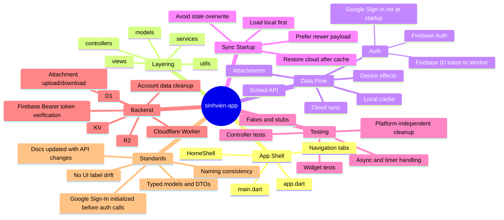

# Project Standardization Mindmap

This document is a compact map of the current repo structure and the main areas that should stay consistent as the project grows.

## How to use it

- Use `App Shell` when checking startup, tab layout, and main navigation.
- Use `Layering` when placing new code or refactoring existing modules.
- Use `Data Flow` and `Sync Startup` when changing cache, sync, auth, or restore behavior.
- Use `Testing` when adding fixtures, timers, or platform-sensitive logic.
- Use `Backend` when working in `cloudflare-worker/`.
- Use `Standards` as the checklist for naming, API compatibility, and docs updates.

## Standardization priorities

1. Keep startup deterministic: local cache should not overwrite a newer remote payload.
2. Keep tests aligned with model changes: update fixtures whenever required fields change.
3. Keep UI labels and docs in sync with the current navigation and page names.
4. Keep attachment and device-effect cleanup best-effort so tests stay platform-safe.
5. Keep architecture boundaries clear: UI in `views/`, orchestration in `controllers/`, business helpers in `utils/`, and integrations in `services/`.

## Related docs

- [Project Overview](./project-overview.md)
- [Project Structure MVC](./project-structure.md)
- [Integration Architecture](./integration-architecture.md)
- [Source Tree Analysis](./source-tree-analysis.md)
