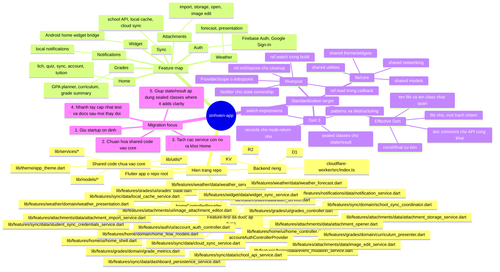

# Project Standardization Mindmap

Tai lieu nay la ban do chuan hoa cua `sinhvien-app` sau khi repo da chuyen
sang feature-first + Riverpod o phan mobile.

No gom 2 lop thong tin:

- hien trang hien tai cua repo;
- huong chuan hoa tiep theo theo skill `dev`:
  `architecture-feature-first` -> `riverpod` -> `dart-3-updates` ->
  `effective-dart`.

## Cach doc

- `Hien trang repo` mo ta dung gia tri that hien co trong source tree.
- `Feature map` giup gan file vao tung domain de refactor khong bi lan.
- `Standardization target` la hinh mau cho cac buoc chuan hoa tiep theo.
- `Migration focus` la thu tu uu tien an toan nhat de khong lam do startup.

## Uu tien chuan hoa

1. Giup startup deterministic: local cache khong bi cloud payload ghi de.
2. Chuan hoa shared code vao `lib/core/` thay vi de lai o `models/`,
   `services/`, `theme/`, `utils/` ma khong co quy uoc ro.
3. Giu `HomeController` va `AccountAuthController` theo Riverpod ownership.
4. Chuyen state/result sang Dart 3 khi no lam code ro hon, khong them phuc tap.
5. Dong bo tests va docs ngay khi doi shape model hoac flow sync.

## Tai lieu lien quan

- [Project Overview](./project-overview.md)

---

_Mindmap nay da duoc cap nhat de phan anh trang thai feature-first + Riverpod
hien tai cua repo._
